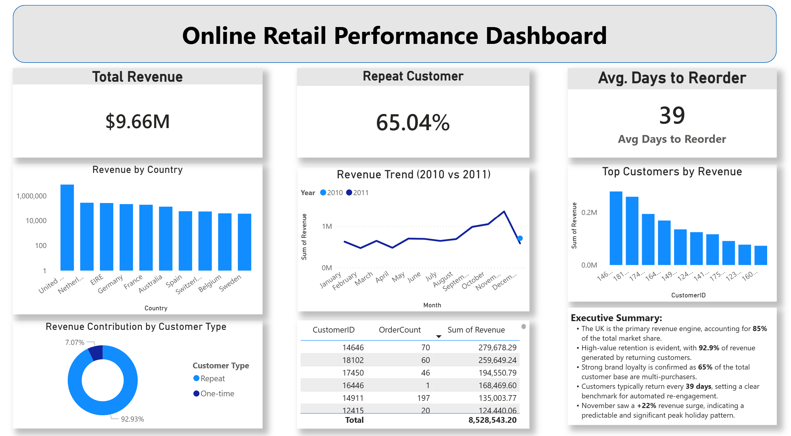
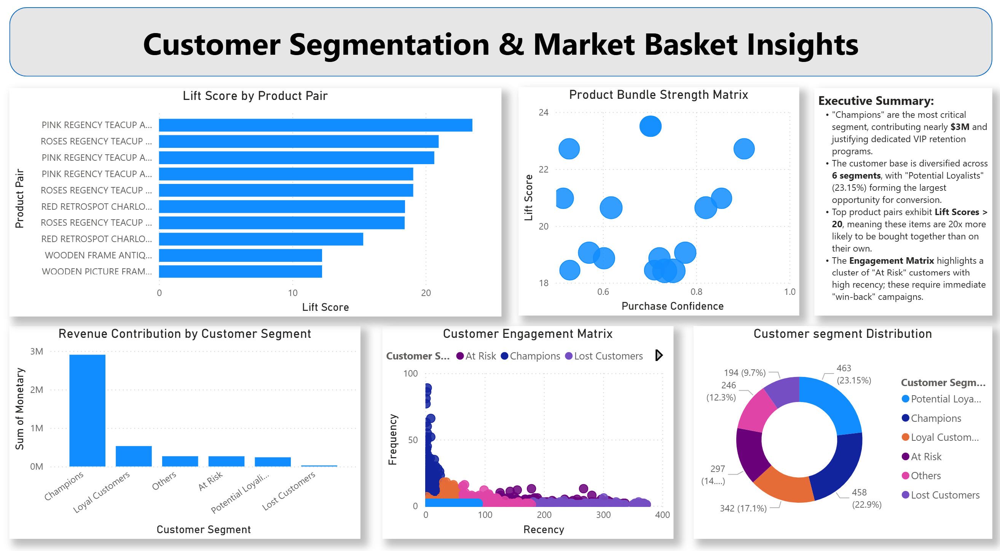

# Online_Retail_Analysis

### Customer Segmentation & Market Basket Analysis

An end-to-end data analytics project using **SQL, Python, Excel, and Power BI** to analyze customer behavior, identify high-value segments, and uncover product bundling opportunities.

---

## 🎯 Business Problem

Retail businesses often struggle to answer:

- Which customers generate the most revenue?
- Which customers are at risk of churn?
- What products are frequently bought together?
- How can cross-selling improve revenue?

This project solves these problems using **customer analytics and association rule mining**.

---


## 🛠 Tools Used

- **SQL** → Data cleaning, transformations, RFM metrics  
- **Python (Apriori)** → Market Basket Analysis  
- **Excel** → Data validation & Sanity Checks  
- **Power BI** → Interactive dashboard  

---

## 🔄 Project Workflow

1. Data Cleaning (SQL)  
2. Feature Engineering (Revenue, Customer Type, etc.)  
3. RFM Customer Segmentation  
4. Market Basket Analysis (Apriori Algorithm)  
5. Dashboard Visualization (Power BI)  

---

## 📊 Dashboard Preview



---

## 📈 Key Insights

- 🟢 **Champions contribute the highest revenue**
- 🟡 **Potential Loyalists represent growth opportunity**
- 🔴 **At-risk customers identified using recency patterns**
- 🛒 **High-lift product pairs indicate strong bundling opportunities**

---

## 📊 Key Visuals

- Customer Engagement Matrix (RFM)
- Revenue Contribution by Segment
- Customer Segment Distribution
- Product Bundle Strength Matrix

---

## 💡 Business Impact

This analysis enables:

- Targeted marketing campaigns  
- Customer retention strategies  
- Cross-selling optimization  
- Increased average order value  

---
## 📁 Project Structure
```
online-retail-analytics/
├── 📁 dashboards/
│   └── Tata.pbix
├── 📁 data/
│   ├── RFM.csv
│   └── Market_Basket_Rules.csv
|   └── Online Retail Data Set.csv
├── 📁 images/
├── 📁 python/
|   └── Online-Retail.ipynb
└── 📁 sql
    ├── 01_Data_Cleaning.sql
    ├── 02_Feature_Engineering.sql
    └── 03_RFM_Analysis.sql
```
## 👤 Author

**Harsh Gupta** 
*Data Analyst*

Connect With Me[](https://www.linkedin.com/in/guptaharsh1401/)

---
*Feel free to connect with me to discuss data analytics, SQL, or Power BI!*
